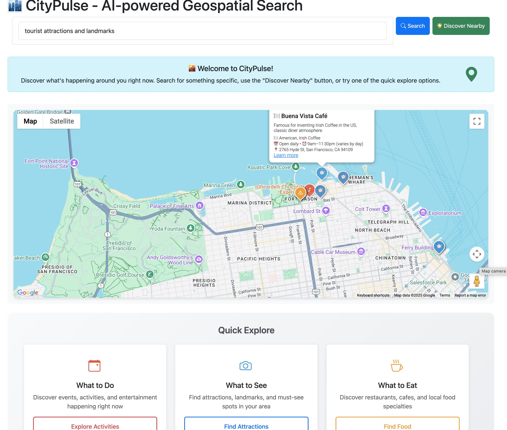
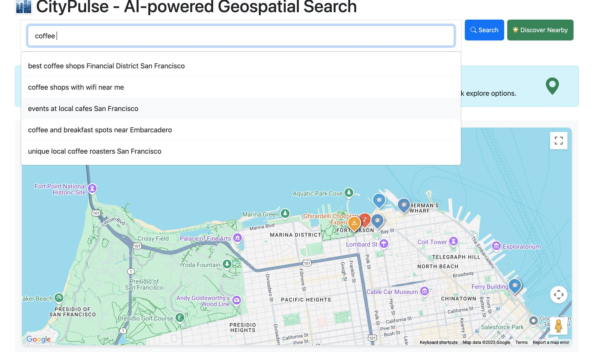
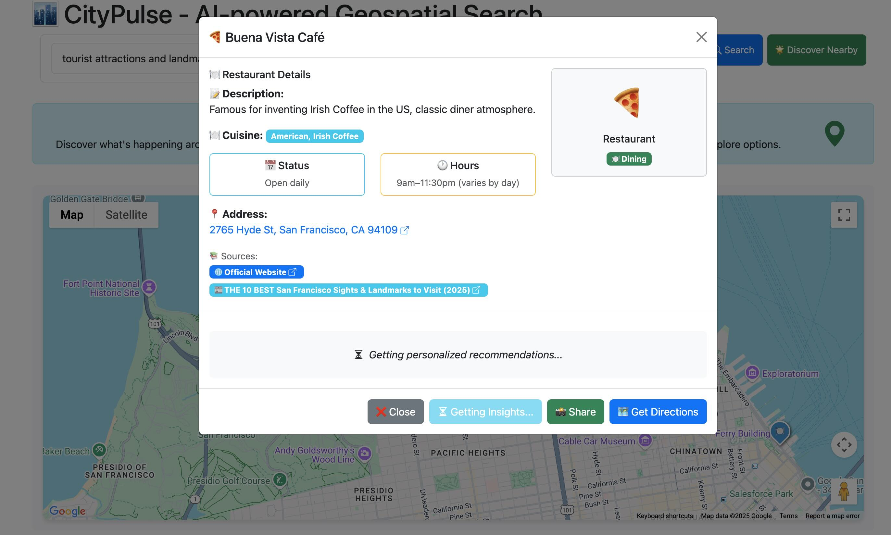
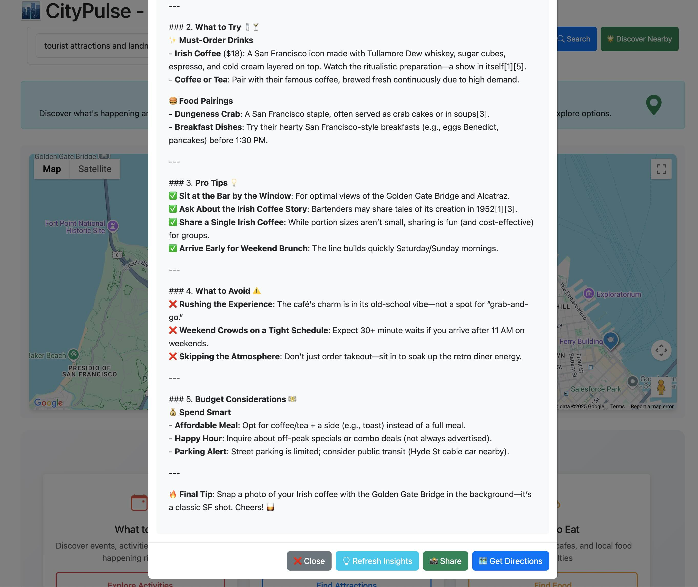

# 🌆 CityPulse - AI-powered Geospatial Discovery Search



**Real-time local discovery powered by Perplexity AI**

CityPulse is an intelligent location-based discovery app that helps users explore what's happening around them right now. Built for the Perplexity AI Hackathon, it leverages advanced AI reasoning to provide personalized, real-time insights about local events, restaurants, alerts, and activities.

## 🏆 Perplexity.AI - Hackathon

This project was developed for the **[Perplexity.AI](https://perplexity.ai)  Hackathon** to showcase:
- **Real-time information retrieval** using Perplexity's Sonar models
- **Structured data extraction** with JSON schema validation
- **AI-powered reasoning** for personalized location insights
- **Location-based search** with geographic context
- **Citation and source verification** for reliable information

## ✨ Key Features

### 🗺️ **Interactive Map Discovery**
- **Real-time location detection** with custom markers
- **Auto-zoom functionality** to fit discovered locations
- **Custom pin styling** with category-based colors (events, restaurants, alerts)
- **Clickable markers** with detailed popup information

### 🔍 **Intelligent Search**
- **AI-powered search suggestions** as you type
- **Natural language queries** (e.g., "coffee shops", "live music tonight")
- **Location-aware results** based on your current position
- **Quick action buttons** for common discovery categories

### 🧠 **AI-Powered Insights**
- **Personalized recommendations** using Perplexity's reasoning model
- **What to try, what to avoid** for each location
- **Best times to visit** and pro tips
- **Budget considerations** and insider knowledge

### 📱 **Modern User Experience**
- **Progressive loading** with elegant spinners
- **Responsive design** for mobile and desktop
- **Modal popups** with rich location details
- **Share functionality** with generated links
- **Navigation integration** with maps apps

### 🔗 **Smart Data Integration**
- **Structured JSON responses** with validation
- **Citation tracking** with source verification
- **Real-time data** from multiple sources
- **Fallback mechanisms** for reliability

## 🚀 Quick Start

### Prerequisites
- Python 3.11+
- Perplexity API key
- Google Maps API key

### Installation

1. **Clone the repository**
```bash
git clone <repository-url>
cd citypulse
```

2. **Install dependencies**
```bash
python3 -m venv venv
source venv/bin/activate
pip install -r requirements.txt
```

3. **Set up environment variables**

Create a `.env` file with API keys:
```env
PERPLEXITY_API_KEY=your_perplexity_api_key_here
GOOGLE_MAPS_API_KEY=your_google_maps_api_key_here
```

4. **Run the application**
```bash
python3 main.py
```

5. **Open your browser**

Navigate to [http://localhost:5001](http://localhost:5001)

## 🎯 How to Use

### 1. **Initial Setup**
- Allow location access when prompted (optional)
- See your current location marked on the map
- View the welcome message with quick action options

### 2. **Discover Nearby Places**
- Click **"🌟 Discover Nearby"** for automatic local discovery
- Use **Quick Explore cards** for specific categories:
  - 🎭 What to Do (events & activities)
  - 📸 What to See (attractions & landmarks)  
  - ☕ What to Eat (restaurants & food)
  - 🛍️ What to Buy (shopping & markets)
  - 📰 What's Happening (local news & events)

### 3. **Custom Search**
- Type in the search box for specific queries
- Get **AI-powered suggestions** as you type
- Use natural language (e.g., "best pizza near me", "outdoor activities")



### 4. **Explore Results**
- Click on **colored map pins** to see basic info
- Click **"Learn more"** for detailed modal with:
  - 📅 Date and time information
  - 📍 Clickable address links
  - 🌐 Official websites and sources
  - 💡 AI-powered insights and recommendations

  

### 5. **Get Personalized Insights**
- Click **"💡 Get Insights"** in any location modal
- Receive AI-generated advice on:
  - Best times to visit
  - What to try and what to avoid
  - Pro tips and budget considerations
  - Personalized recommendations



### 6. **Share & Navigate**
- **Share locations** with friends via generated links
- **Get directions** using your preferred maps app
- **Copy shareable URLs** for easy distribution

## 🔧 Technical Architecture

### **Backend (FastHTML + Python)**
- **FastHTML framework** for rapid web development
- **Perplexity API integration** with multiple models
- **JSON schema validation** for structured responses
- **In-memory data storage** for shared locations
- **RESTful API endpoints** for all functionality

### **Frontend (Vanilla JavaScript + Bootstrap)**
- **Google Maps JavaScript API** for interactive mapping
- **Bootstrap 5** for responsive UI components
- **Custom CSS** for enhanced styling
- **Progressive enhancement** with loading states
- **Real-time search suggestions** with debouncing

### **AI Integration (Perplexity API)**
- **Sonar models** for real-time information retrieval
- **Sonar Reasoning** for personalized insights
- **Structured output** with JSON schema enforcement
- **Citation tracking** for source verification
- **Geographic context** for location-aware results

## 📊 API Endpoints

| Endpoint | Method | Description |
|----------|--------|-------------|
| `/` | GET | Main application interface |
| `/api/local-data` | GET | Get nearby events, restaurants, alerts |
| `/api/search-local` | GET | Search for specific local content |
| `/api/search-suggestions` | GET | Get AI-powered search suggestions |
| `/api/location-insights` | GET | Get personalized location recommendations |
| `/api/share-location` | POST | Create shareable location links |
| `/api/get-shared-location/{id}` | GET | Retrieve shared location data |
| `/shared/{id}` | GET | View shared location page |

## 🌟 Perplexity AI Integration

### **Models Used**
- **`sonar`** - Real-time information retrieval
- **`sonar-reasoning`** - Advanced reasoning for insights

### **Key Features Leveraged**
- **Real-time data access** for current information
- **Geographic search** with coordinate-based queries
- **Structured output** with JSON schema validation
- **Citation tracking** for source verification
- **Reasoning capabilities** for personalized advice

### **Example Queries**
```python
# Location-based discovery
api.geo_structured_output_with_citations(
    prompt="Find events, restaurants, and alerts near coordinates 37.7749, -122.4194",
    schema=LOCAL_INFO_SCHEMA
)

# Personalized insights
api.get_location_insights(
    location_name="Blue Bottle Coffee",
    location_type="restaurant", 
    description="Specialty coffee roaster",
    address="315 Linden St, Oakland, CA"
)
```

## 🎨 Design Highlights

- **Clean, modern interface** with intuitive navigation
- **Color-coded categories** for easy recognition
- **Smooth animations** and hover effects
- **Mobile-first responsive design**
- **Professional loading states** with progress indicators
- **Accessible UI** with proper contrast and sizing

## 🔮 Future Enhancements

- **User accounts** with saved favorites
- **Push notifications** for location-based alerts
- **Social features** with reviews and ratings
- **Advanced filtering** by price, rating, distance
- **Offline mode** with cached data
- **Multi-language support** for international users

## 🤝 Contributing

1. Fork the repository
2. Create a feature branch (`git checkout -b feature/amazing-feature`)
3. Commit your changes (`git commit -m 'Add amazing feature'`)
4. Push to the branch (`git push origin feature/amazing-feature`)
5. Open a Pull Request

## 📄 License

This project is licensed under the MIT License - see the [LICENSE](./LICENSE) file for details.

## 🙏 Acknowledgments

- **[Perplexity.AI](https://perplexity.ai)** for providing the powerful [Sonar API](https://sonar.perplexity.ai) and hosting the [hackathon](https://perplexityhackathon.devpost.com)
- **[FastHTML](https://www.fastht.ml)** for the rapid development framework
- **[Google Maps](https://developers.google.com/maps)** for the interactive mapping platform
- **[Bootstrap](https://getbootstrap.com)** for the responsive UI components

---

*Discover your city like never before with AI-powered local insights*

**Built with ❤️ by [Alex Nevsky](https://alexnevsky.com)**